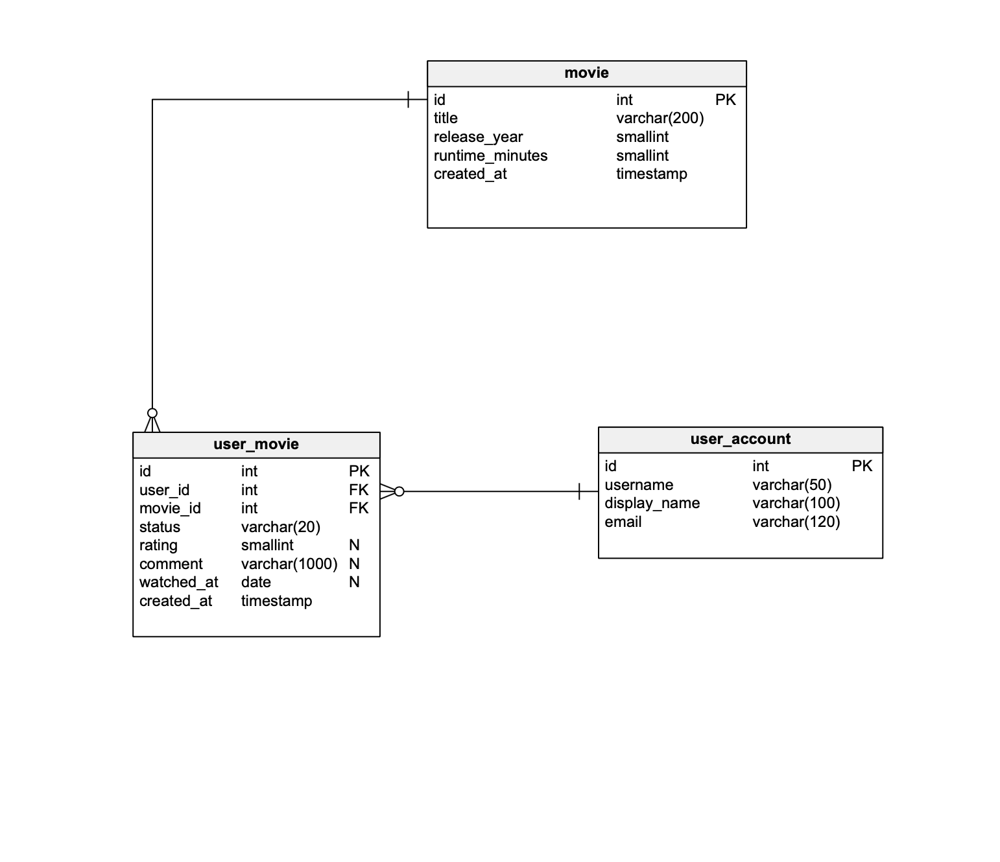

# 🎬 MovieList

A Spring Boot + HSQLDB application for managing movies and user watch states.  
Users can browse movies, add new ones, update details, delete them, and track their personal status (**WATCHED / TO_WATCH** with rating and comments).

This project was created as part of the **IT Crafters training program**.  
It demonstrates a clean **Controller → Service → Repository** layering, externalized SQL scripts (`schema.sql`, `data.sql`), and IntelliJ-friendly setup.  

👉 Repo: [https://github.com/raidolehtla/movielist](https://github.com/raidolehtla/movielist)

---

## 📑 Table of Contents

- [Description](#description)
- [Prerequisites](#prerequisites)
- [Getting Started](#getting-started)
    - [Clone the repository](#clone-the-repository)
    - [Build & Run (IntelliJ IDEA)](#build--run-intellij-idea)
    - [Swagger UI](#swagger-ui)
- [Configuration](#configuration)
- [Database Initialization](#database-initialization)
- [Database Structure](#database-structure)
- [Available Endpoints](#available-endpoints)
- [Project Structure](#project-structure)

---

## 📝 Description

The **MovieList** application implements core CRUD operations for managing a movie list:

**MVP**

- Find a movie by ID
- List all movies
- Add a movie
- Update a movie
- Delete a movie
- Add/update user state (WATCHED / TO_WATCH + rating + comment)

Built on **Spring Boot** and **in-memory HSQLDB**, this project is reset on each startup using schema + seed data.

---

## ⚡ Prerequisites

- Java 21
- Gradle (or included `gradlew`)
- IntelliJ IDEA (recommended)

---

## 🚀 Getting Started

### Clone the repository

```bash
git clone https://github.com/raidolehtla/movielist.git
```

### Build & Run (IntelliJ IDEA)

1. **Open the project**  
   In IntelliJ, select **File ▸ Open…** and choose the root folder (`build.gradle` present).

2. **Run the app**  
   Navigate to `src/main/java/ee/raido/movielist/MovielistApplication.java`  
   Click the green ▶︎ icon or right-click → **Run 'MovielistApplication'**.

3. **Verify startup**  
   App runs on port **8080**.

4. **Swagger UI**  
   Open: [http://localhost:8080/swagger-ui/index.html](http://localhost:8080/swagger-ui/index.html)

5. **Stop the server**  
   Red ■ icon in IntelliJ Run window or `Ctrl + F2` (Win/Linux), `⌘ + F2` (macOS).

---

## ⚙️ Configuration

Runtime settings:

```
src/main/resources/application.properties
```

---

## 🗄️ Database Initialization

Spring Boot auto-runs:

- `schema.sql` → creates tables & constraints
- `data.sql` → inserts sample data (movies, users, user states)

---

## 🗃️ Database Structure



- **movie** – Movies
- **user_account** – Application users
- **user_movie** – Relations: user ↔ movie with status, rating, comment

---

## 🌐 Available Endpoints

| Method | Path               | Description      |
|--------|--------------------|------------------|
| GET    | `/api/movies/{id}` | Get movie by ID  |
| GET    | `/api/movies`      | List all movies  |
| POST   | `/api/movies`      | Create new movie |
| PUT    | `/api/movies/{id}` | Update movie     |
| DELETE | `/api/movies/{id}` | Delete movie     |

---

## 📂 Project Structure

movielist/
├── src/
│ ├── main/
│ │ ├── java/
│ │ │ └── ee/raido/movielist/
│ │ │ ├── controller/ # REST layer: endpoints & DTOs
│ │ │ │ ├── movie/
│ │ │ │ │ ├── MovieController.java # REST endpoints for movies (CRUD + user state)
│ │ │ │ │ └── dto/
│ │ │ │ │ └── MovieDto.java # API-facing DTO for movies (with optional user state)
│ │ │ │ └── usermovie/
│ │ │ │ └── UserMovieDto.java # API-facing DTO for user–movie relation (status, rating, comment)
│ │ │ │
│ │ │ ├── infrastructure/ # Infrastructure & configuration
│ │ │ │ ├── db/
│ │ │ │ │ └── HsqlServerConfig.java # Starts embedded HSQLDB server (TCP:9001) for development
│ │ │ │ └── rest/
│ │ │ │ ├── error/
│ │ │ │ │ ├── ApiError.java # Standardized error response for REST
│ │ │ │ │ └── Error.java # Error details (field, message, etc.)
│ │ │ │ ├── exception/
│ │ │ │ │ ├── DataNotFoundException.java # Thrown when entity not found
│ │ │ │ │ └── ForbiddenException.java # Thrown when access is denied
│ │ │ │ └── RestExceptionHandler.java # Global exception → ApiError mapper
│ │ │ │
│ │ │ ├── persistence/ # Persistence layer: entities, repos, mappers
│ │ │ │ ├── movie/
│ │ │ │ │ ├── Movie.java # JPA entity for MOVIE table
│ │ │ │ │ ├── MovieRepository.java # Spring Data JPA repository
│ │ │ │ │ └── MovieMapper.java # MapStruct mapper (Movie ↔ MovieDto)
│ │ │ │ ├── useraccount/
│ │ │ │ │ ├── UserAccount.java # JPA entity for USER_ACCOUNT table
│ │ │ │ │ └── UserAccountRepository.java # Repository for user accounts
│ │ │ │ └── usermovie/
│ │ │ │ ├── UserMovie.java # JPA entity for USER_MOVIE relation
│ │ │ │ └── UserMovieRepository.java # Repository for user–movie links
│ │ │ │
│ │ │ ├── service/ # Business logic layer
│ │ │ │ └── movie/
│ │ │ │ └── MovieService.java # Handles CRUD + user state logic (watched, rating, comment)
│ │ │ │
│ │ │ └── MovielistApplication.java # Main Spring Boot entrypoint
│ │ │
│ │ └── resources/
│ │ ├── application.properties # Spring Boot runtime configuration
│ │ ├── schema.sql # DDL script: creates tables & constraints
│ │ ├── data.sql # Seed data: users, movies, ratings
│ │ ├── static/ # Static web resources (if needed)
│ │ └── templates/ # Thymeleaf templates (if needed)
│ │
│ └── test/
│ └── java/
│ └── ee/raido/movielist/
│ └── MovielistApplicationTests.java # Basic Spring Boot integration test
│
├── docs/
│ └── ERD.png # Database schema diagram
│
├── build.gradle # Gradle build script
├── settings.gradle # Gradle settings
├── gradlew / gradlew.bat # Gradle wrapper scripts
├── .gitignore # Files ignored by Git
└── README.md # Project documentation

---

## ✅ Notes

- Database resets each restart (in-memory HSQLDB).
- Extendable: add new endpoints and entities by following **Controller → Service → Repository** layering.
- Check Swagger UI for live API docs.  
